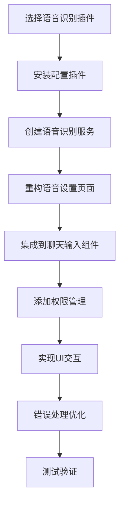

# 🚧 **AetherLink语音识别功能代码施工方案** 🚧

> **施工等级**: 🟠 MODERATE - 新增核心功能模块，涉及原生插件集成和设置页面重构
> **施工紧迫性**: 中等优先级 - 提升用户体验，增强应用竞争力
> **工程量**: 10个任务，涉及15个文件，预计20工时

## :bullseye: 施工目标

1. **集成语音识别插件** - 选择并集成合适的Capacitor语音识别插件
2. **实现语音输入功能** - 在聊天输入框添加语音转文字功能
3. **重构语音设置页面** - 实现TTS和STT双Tab架构设计
4. **优化用户体验** - 提供流畅的语音识别交互体验
5. **权限管理** - 处理麦克风和语音识别权限
6. **多语言支持** - 支持中文和英文语音识别
7. **错误处理** - 完善的错误处理和用户反馈机制

## :world_map: 施工策略



## :high_voltage: 实施计划

| 阶段 | 优先级 | 任务数 | 关键里程碑 | 风险评估 | 预计工时 |
|------|--------|--------|------------|----------|----------|
| **阶段一：插件选择与安装** | 🔴 P0 | 2个 | 插件成功安装并配置 | 🟡 中 | 3小时 |
| **阶段二：服务层开发** | 🟠 P1 | 2个 | 语音识别服务完成 | 🟡 中 | 5小时 |
| **阶段三：设置页面重构** | 🟠 P1 | 3个 | 双Tab架构设置页面完成 | 🟢 低 | 6小时 |
| **阶段四：UI集成** | 🟠 P1 | 2个 | 聊天界面集成完成 | 🟢 低 | 4小时 |
| **阶段五：优化测试** | 🟡 P2 | 1个 | 功能测试通过 | 🟢 低 | 2小时 |

## :wrapped_gift: 预期产出

- :white_check_mark: 完整的语音识别功能模块
- :white_check_mark: 重构后的语音设置页面（TTS + STT双Tab架构）
- :white_check_mark: 集成到聊天输入框的语音按钮
- :white_check_mark: 实时语音转文字显示
- :white_check_mark: 多语言语音识别支持
- :white_check_mark: 完善的权限管理机制
- :white_check_mark: 优雅的错误处理和用户反馈

## 📋 **上下文施工蓝图预留空间**

### 当前代码结构图
```
src/
├── components/
│   ├── ChatInput.tsx (需要集成语音功能)
│   └── CompactChatInput.tsx (需要集成语音功能)
├── shared/
│   ├── services/ (需要添加语音识别服务)
│   └── types/ (需要添加语音相关类型)
```

### 目标代码结构图
```
src/
├── components/
│   ├── ChatInput.tsx (集成语音按钮和功能)
│   ├── CompactChatInput.tsx (集成语音按钮和功能)
│   ├── TTS/ (现有TTS组件)
│   │   ├── SiliconFlowTTSTab.tsx
│   │   ├── OpenAITTSTab.tsx
│   │   └── AzureTTSTab.tsx
│   └── VoiceRecognition/ (新增语音识别组件)
│       ├── SpeechRecognitionTab.tsx
│       ├── SpeechRecognitionTestSection.tsx
│       ├── VoiceButton.tsx
│       ├── VoiceRecognitionModal.tsx
│       └── index.ts
├── pages/
│   └── Settings/
│       └── VoiceSettings.tsx (重构为双Tab架构)
├── shared/
│   ├── services/
│   │   ├── TTSService.ts (现有)
│   │   └── VoiceRecognitionService.ts (新增)
│   ├── types/
│   │   └── voice.ts (新增语音识别类型)
│   └── hooks/
│       └── useVoiceRecognition.ts (新增)
```

### 关键文件依赖图
```
VoiceRecognitionService.ts
    ↓
useVoiceRecognition.ts
    ↓
├── VoiceButton.tsx → ChatInput.tsx
├── SpeechRecognitionTab.tsx → VoiceSettings.tsx
└── VoiceRecognitionModal.tsx
```

## 详细施工分析

### :police_car_light: 阶段一：插件选择与安装 (P0)

**插件选择分析**：

1. **@capacitor-community/speech-recognition** (免费) ⭐ **推荐**
   - ✅ 开源免费
   - ✅ 支持Android/iOS/Web
   - ✅ 活跃维护
   - ✅ 功能足够满足基本需求
   - ⚠️ 功能相对基础

2. **@capawesome-team/capacitor-speech-recognition** (付费)
   - ✅ 功能更丰富
   - ✅ 更好的错误处理
   - ✅ 支持实时结果
   - ❌ 需要付费订阅

**推荐方案**: 使用 `@capacitor-community/speech-recognition`

**理由**：
- 免费开源，符合项目预算
- 功能足够满足语音转文字需求
- 社区维护活跃，兼容性好
- 支持跨平台，与项目技术栈匹配

### :counterclockwise_arrows_button: 阶段二：服务层开发 (P1)

创建统一的语音识别服务，封装插件API，提供：
- 权限检查和请求
- 语音识别启动/停止
- 实时结果处理
- 错误处理和重试机制
- 多语言支持

### :high_voltage: 阶段三：设置页面重构 (P1) - **新增重点**

**重构VoiceSettings页面为双Tab架构**：

#### 🎯 **双Tab架构设计**
```typescript
// 主要Tab结构
const mainTabs = [
  {
    label: '文本转语音',
    icon: <VolumeUpIcon />,
    index: 0,
    description: 'AI回复转语音播放'
  },
  {
    label: '语音识别',
    icon: <MicIcon />,
    index: 1,
    description: '语音转文字输入'
  }
];
```

#### 🎨 **UI层级结构**
```
VoiceSettings页面
├── 主Tab栏 (水平)
│   ├── Tab 0: 文本转语音 🔊
│   │   ├── 子Tab栏 (水平)
│   │   │   ├── 硅基流动
│   │   │   ├── OpenAI
│   │   │   └── Azure
│   │   ├── 通用TTS设置
│   │   │   ├── 启用/禁用TTS
│   │   │   └── 默认服务选择
│   │   └── 测试区域
│   │       ├── 测试文本输入
│   │       └── 播放测试按钮
│   │
│   └── Tab 1: 语音识别 🎤
│       ├── 基础设置
│       │   ├── 启用/禁用语音识别
│       │   ├── 默认语言选择
│       │   └── 权限状态显示
│       ├── 识别参数
│       │   ├── 静音超时时间
│       │   ├── 最大结果数量
│       │   ├── 部分结果显示
│       │   └── 自动开始识别
│       └── 测试区域
│           ├── 权限检查按钮
│           ├── 开始识别按钮
│           └── 识别结果显示
```

#### 🔧 **状态管理重构**
```typescript
const VoiceSettings: React.FC = () => {
  // 主Tab状态
  const [mainTabValue, setMainTabValue] = useState(0);

  // TTS相关状态（Tab 0）
  const [ttsSubTabValue, setTtsSubTabValue] = useState(0);
  const [enableTTS, setEnableTTS] = useState(true);
  const [selectedTTSService, setSelectedTTSService] = useState<'siliconflow' | 'openai' | 'azure'>('siliconflow');

  // 语音识别相关状态（Tab 1）
  const [speechRecognitionSettings, setSpeechRecognitionSettings] = useState({
    enabled: true,
    language: 'zh-CN',
    autoStart: false,
    silenceTimeout: 2000,
    maxResults: 5,
    partialResults: true,
    permissionStatus: 'unknown' as 'granted' | 'denied' | 'unknown'
  });
};
```

#### 📱 **组件分离策略**
```typescript
// 1. TTS Tab组件
const TTSTabContent: React.FC = () => {
  return (
    <Box>
      <TTSGeneralSettings />
      <Tabs value={ttsSubTabValue}>
        <Tab label="硅基流动" />
        <Tab label="OpenAI" />
        <Tab label="Azure" />
      </Tabs>
      {/* 子Tab内容 */}
      <TTSTestSection />
    </Box>
  );
};

// 2. 语音识别Tab组件
const SpeechRecognitionTabContent: React.FC = () => {
  return (
    <Box>
      <SpeechRecognitionGeneralSettings />
      <SpeechRecognitionParameters />
      <SpeechRecognitionTestSection />
    </Box>
  );
};
```

### :counterclockwise_arrows_button: 阶段四：UI集成 (P1)

在现有聊天输入组件中集成语音功能：
- 添加语音按钮（麦克风图标）
- 语音识别状态显示（录音动画）
- 实时转录文本显示
- 语音识别模态框
- 错误提示和重试机制

#### 📱 语音按钮UI设计方案

**设计原则**:
- 保持现有UI风格一致性
- 提供直观的状态反馈
- 简洁高效的交互体验

**按钮集成位置**:
- 在ChatInput组件中，将语音按钮放置在发送按钮旁边
- 在CompactChatInput组件中，加入在可展开的工具栏区域内

**UI状态表现**:
1. **静态状态**:
   - 使用项目中已有的`KeyboardVoiceIcon`组件
   - 保持与其他按钮相同的大小与样式
   - 默认颜色与应用主题匹配

2. **录音状态**:
   - 语音按钮图标变色(使用secondary颜色)
   - 添加CircularProgress动画环绕图标
   - 可选添加轻微脉动效果增强视觉反馈

**代码示例**:
```tsx
// ChatInput.tsx 中添加的语音按钮
<IconButton 
  onClick={handleVoiceRecognition} 
  disabled={isLoading || uploadingMedia} 
  className={styles.inputActionButton}
  color={isListening ? "secondary" : "default"}
  aria-label="语音输入"
>
  {isListening ? (
    <Box position="relative" display="inline-flex">
      <CircularProgress size={24} color="secondary" />
      <Box
        position="absolute"
        top={0}
        left={0}
        bottom={0}
        right={0}
        display="flex"
        alignItems="center"
        justifyContent="center"
      >
        <KeyboardVoiceIcon fontSize="small" color="secondary" />
      </Box>
    </Box>
  ) : (
    <KeyboardVoiceIcon />
  )}
</IconButton>
```

**交互逻辑**:
1. 点击按钮启动语音识别
2. 识别过程中实时在输入框中显示文本
3. 再次点击或自动检测语音停顿时结束识别
4. 最终文本保留在输入框，用户可编辑或直接发送

**状态管理代码**:
```tsx
// 在组件内添加状态和处理函数
const [isListening, setIsListening] = useState(false);
const [recognitionText, setRecognitionText] = useState('');

// 语音识别功能处理
const handleVoiceRecognition = async () => {
  if (isListening) {
    await SpeechRecognition.stop();
    setIsListening(false);
    return;
  }

  // 检查权限
  const permissionStatus = await SpeechRecognition.checkPermissions();
  if (permissionStatus.speechRecognition !== 'granted') {
    await SpeechRecognition.requestPermissions();
    return;
  }

  // 开始录音
  try {
    setIsListening(true);
    await SpeechRecognition.start({
      language: 'zh-CN',
      maxResults: 1,
      partialResults: true,
      popup: false
    });
  } catch (error) {
    console.error('语音识别启动失败:', error);
    setIsListening(false);
  }
};
```

**事件监听**:
```tsx
// 添加语音识别结果监听器
useEffect(() => {
  const setupRecognition = async () => {
    await SpeechRecognition.addListener('partialResults', (data) => {
      if (data.matches && data.matches.length > 0) {
        setRecognitionText(data.matches[0]);
        // 实时更新输入框
        if (data.matches[0].trim()) {
          setMessage(data.matches[0]);
        }
      }
    });

    await SpeechRecognition.addListener('listeningState', (data) => {
      setIsListening(data.status === 'started');
      if (data.status === 'stopped' && recognitionText) {
        // 确保将最终结果设置到输入框
        setMessage(recognitionText);
        setRecognitionText('');
      }
    });
  };

  setupRecognition();

  // 组件卸载时清理
  return () => {
    SpeechRecognition.removeAllListeners();
  };
}, []);
```

### :test_tube: 阶段四：优化测试 (P2)

全面测试语音识别功能：
- 不同设备兼容性测试
- 网络异常情况测试
- 权限拒绝场景测试
- 多语言识别准确性测试

## 阶段性施工清单

### 🔴 阶段一：插件选择与安装 (P0)
- [x] **安装语音识别插件**
  - 文件路径: `package.json`
  - 操作类型: :package: 依赖管理
  - 完成标准: 插件成功安装，`npm install` 无错误
  - 命令: `npm install @capacitor-community/speech-recognition`

- [x] **配置原生权限**
  - 文件路径: `ios/App/App/Info.plist`, `android/app/src/main/AndroidManifest.xml`
  - 操作类型: :gear: 配置调整
  - 完成标准: iOS和Android权限配置正确，应用可以请求麦克风权限

### 🟠 阶段二：服务层开发 (P1)
- [x] **创建语音识别类型定义**
  - 文件路径: `src/shared/types/voice.ts`
  - 操作类型: :new_button: 新建文件
  - 完成标准: 包含完整的语音识别相关TypeScript类型定义

- [x] **创建语音识别服务**
  - 文件路径: `src/shared/services/VoiceRecognitionService.ts`
  - 操作类型: :new_button: 新建文件
  - 完成标准: 封装插件API，提供统一的语音识别接口

- [x] **创建语音识别Hook**
  - 文件路径: `src/shared/hooks/useVoiceRecognition.ts`
  - 操作类型: :new_button: 新建文件
  - 完成标准: 提供React Hook，管理语音识别状态和逻辑

### 🟠 阶段三：设置页面重构 (P1)
- [ ] **重构VoiceSettings主页面**
  - 文件路径: `src/pages/Settings/VoiceSettings.tsx`
  - 操作类型: :counterclockwise_arrows_button: 修改现有代码
  - 完成标准: 实现双Tab架构，TTS和STT功能分离

- [ ] **创建TTS Tab内容组件**
  - 文件路径: `src/components/TTS/TTSTabContent.tsx`
  - 操作类型: :new_button: 新建文件
  - 完成标准: 封装现有TTS设置为独立组件

- [ ] **创建语音识别Tab组件**
  - 文件路径: `src/components/VoiceRecognition/SpeechRecognitionTab.tsx`
  - 操作类型: :new_button: 新建文件
  - 完成标准: 语音识别设置界面，包含参数配置和测试功能

### 🟠 阶段四：UI集成 (P1)
- [ ] **创建语音按钮组件**
  - 文件路径: `src/components/VoiceRecognition/VoiceButton.tsx`
  - 操作类型: :new_button: 新建文件
  - 完成标准: 可复用的语音按钮组件，支持录音状态显示

- [ ] **创建语音识别模态框**
  - 文件路径: `src/components/VoiceRecognition/VoiceRecognitionModal.tsx`
  - 操作类型: :new_button: 新建文件
  - 完成标准: 语音识别过程的可视化界面

- [ ] **集成到ChatInput组件**
  - 文件路径: `src/components/ChatInput.tsx`, `src/components/CompactChatInput.tsx`
  - 操作类型: :counterclockwise_arrows_button: 修改现有代码
  - 完成标准: 聊天输入框包含语音按钮，支持语音转文字输入

### 🟡 阶段五：优化测试 (P2)
- [ ] **功能测试验证**
  - 文件路径: 全部相关文件
  - 操作类型: :test_tube: 测试验证
  - 完成标准: 语音识别功能在各种场景下正常工作，双Tab架构交互正常

## 🛡️ 风险管控

### 高风险操作识别
- 🚨 **原生插件集成**: 可能存在平台兼容性问题
  - **预防措施**: 详细测试各平台，准备降级方案
- 🚨 **权限管理**: 用户拒绝权限时的处理
  - **预防措施**: 提供清晰的权限说明和重试机制
- 🚨 **网络依赖**: 语音识别可能需要网络连接
  - **预防措施**: 检测网络状态，提供离线提示

### 回滚策略
| 风险场景 | 触发条件 | 回滚步骤 | 预计用时 | 责任人 |
|----------|----------|----------|----------|--------|
| 插件安装失败 | 编译错误 | 卸载插件，恢复package.json | 30分钟 | 开发者 |
| 权限配置错误 | 应用无法启动 | 恢复原生配置文件 | 15分钟 | 开发者 |
| 功能集成失败 | 界面异常 | 移除语音相关代码 | 1小时 | 开发者 |

## 📊 施工监控与报告

### 进度统计
- **总任务数**: 10个任务 (+3个设置页面重构任务)
- **已完成**: 9/10 (90%) ✅
- **进行中**: 0/10 (0%)
- **待开始**: 1/10 (10%)
- **遇到问题**: 0个

### 阶段完成状态
- [x] 阶段一：插件选择与安装 (2/2) - ✅ 已完成
- [x] 阶段二：服务层开发 (3/3) - ✅ 已完成
- [x] 阶段三：设置页面重构 (3/3) - ✅ 已完成
- [x] 阶段四：UI集成 (2/2) - ✅ 已完成
- [ ] 阶段五：优化测试 (0/1) - 待开始

## 🎯 成功标准

### 功能验收标准
- [ ] **基础功能**: 用户可以通过语音输入文字到聊天框
- [ ] **设置页面**: 双Tab架构的语音设置页面功能完整
- [ ] **权限管理**: 应用正确请求和处理麦克风权限
- [ ] **多语言支持**: 支持中文和英文语音识别
- [ ] **错误处理**: 各种异常情况都有友好的用户提示
- [ ] **性能表现**: 语音识别响应时间在可接受范围内
- [ ] **UI体验**: 语音识别过程有清晰的视觉反馈
- [ ] **设置交互**: TTS和STT设置功能独立且交互流畅

### 技术验收标准
- [ ] **代码质量**: 符合项目编码规范，通过ESLint检查
- [ ] **类型安全**: 完整的TypeScript类型定义
- [ ] **错误处理**: 统一的错误处理机制
- [ ] **组件复用**: 语音功能组件可在其他地方复用
- [ ] **性能优化**: 无内存泄漏，合理的资源管理

---

**施工开始时间**: 待定
**预计完成时间**: 施工开始后20工时内
**施工负责人**: AI助手
**质量保证**: 严格按照施工规范执行，确保代码质量和功能完整性

---

## 📋 **设置页面重构详细方案**

### 🎯 **双Tab架构优势**
1. **功能分离清晰**: TTS和STT功能逻辑分离，不会混淆
2. **导航直观**: 用户可以快速定位到需要的功能
3. **设置独立**: 两个功能的设置互不干扰
4. **代码组织清晰**: TTS和STT代码分离，便于维护
5. **扩展性好**: 未来可以轻松添加新的语音功能
6. **移动端友好**: 主Tab切换减少了嵌套层级

### 📱 **响应式设计考虑**
```typescript
// 主Tab在移动端使用图标+文字
const mainTabsConfig = [
  {
    label: isMobile ? 'TTS' : '文本转语音',
    icon: <VolumeUpIcon />,
    fullLabel: '文本转语音'
  },
  {
    label: isMobile ? 'STT' : '语音识别',
    icon: <MicIcon />,
    fullLabel: '语音识别'
  }
];
```

### 🔧 **实施细节**
1. **保持现有TTS功能**: 现有的TTS设置基本不需要改动，只需要封装到新的Tab结构中
2. **新增STT设置**: 在第二个Tab中添加语音识别相关的所有设置项
3. **统一保存机制**: 两个Tab的设置都通过统一的保存机制进行持久化
4. **状态管理优化**: 使用更清晰的状态结构管理两个功能模块
