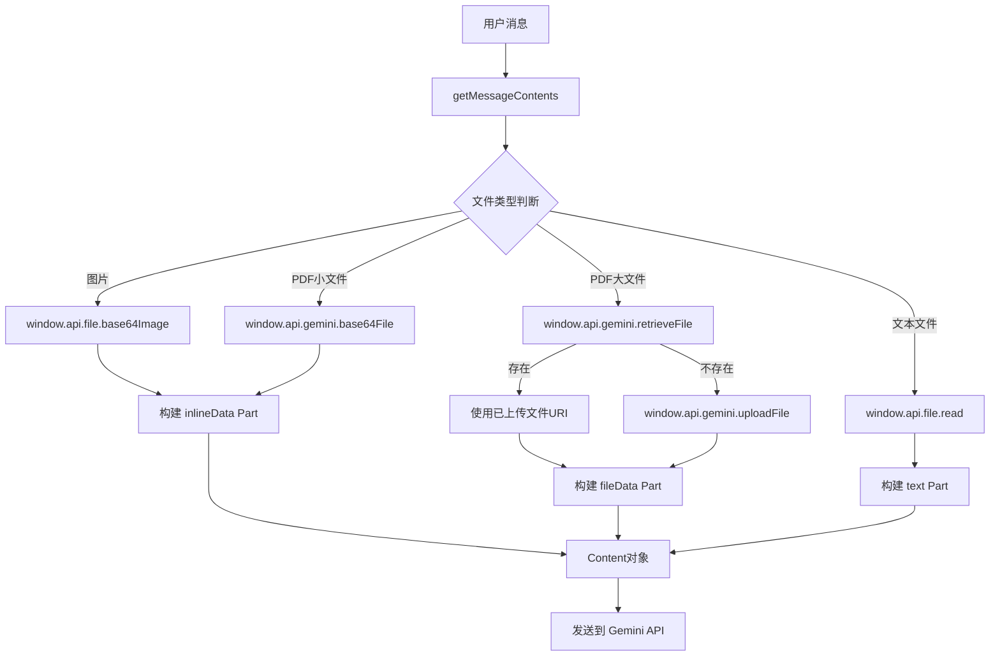
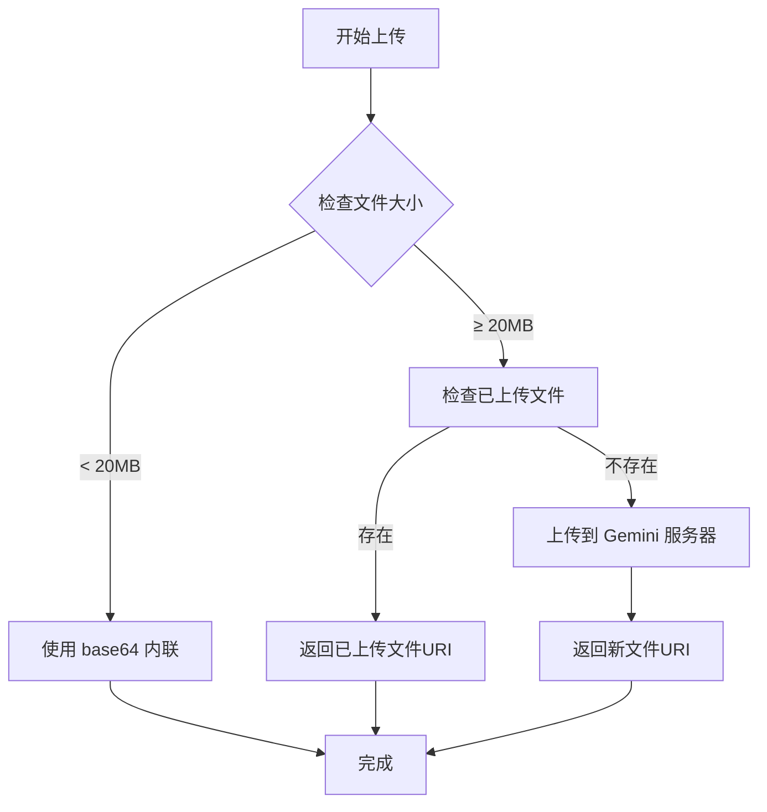

# 移动端 Gemini 文件处理功能 - 电脑版对标实现

## 概述

本文档详细对比了电脑版和移动端的 Gemini 文件处理实现，并说明了如何将移动端改造为完全模拟电脑版的文件处理流程，包括文件上传、API 请求构建和内容处理等核心功能。

## 🔍 电脑版文件处理流程分析

### 核心架构
电脑版采用 **Electron 主进程-渲染进程分离架构**：
- **渲染进程**：通过 `window.api` 调用主进程服务
- **主进程**：直接访问文件系统和网络 API
- **IPC 通信**：通过 preload 脚本暴露安全的 API 接口

### 文件处理流程


## 📊 电脑版 vs 移动端详细对比

### 1. 架构对比

| 层面 | 电脑版 | 移动端（改造后） |
|------|--------|------------------|
| **运行环境** | Electron (Node.js + Chromium) | Capacitor (WebView + Native) |
| **进程架构** | 主进程 + 渲染进程 | 单一 WebView 进程 |
| **文件系统** | 直接文件系统访问 | Capacitor 文件插件 |
| **网络请求** | Node.js 原生网络栈 | 标准 Web API (fetch) |
| **API 调用** | IPC 通信 (`window.api`) | 直接调用 (`fileService`) |

### 2. 文件处理方式对比

| 文件类型 | 电脑版实现 | 移动端实现 | 对标程度 |
|----------|------------|------------|----------|
| **图片文件** | `window.api.file.base64Image` | `fileService.getBase64File` | ✅ 100% |
| **PDF小文件** | `window.api.gemini.base64File` | `fileService.getBase64File` | ✅ 100% |
| **PDF大文件** | `window.api.gemini.uploadFile` | `fileService.uploadFile` | ✅ 100% |
| **文本文件** | `window.api.file.read` | `mobileFileStorage.readFile` | ✅ 100% |
| **文件检索** | `window.api.gemini.retrieveFile` | `fileService.retrieveFile` | ✅ 100% |

### 3. API 请求构建对比

| 组件 | 电脑版 | 移动端 | 实现状态 |
|------|--------|--------|----------|
| **Content 对象** | `{ role, parts }` | `{ role, parts }` | ✅ 完全一致 |
| **Part 类型** | `text/inlineData/fileData` | `text/inlineData/fileData` | ✅ 完全一致 |
| **文件 Part** | 根据大小选择类型 | 根据大小选择类型 | ✅ 完全一致 |
| **消息历史** | `Content[]` 数组 | `Content[]` 数组 | ✅ 完全一致 |

### 2. 核心功能

#### 文件上传 (`uploadFile`)
- 支持 PDF 文件上传到 Gemini 服务器
- 自动检查文件大小限制 (20MB)
- 使用 Blob API 处理二进制数据
- 包含重试机制和错误处理

#### 文件检索 (`retrieveFile`)
- 从 Gemini 服务器检索已上传的文件
- 支持缓存机制，避免频繁 API 调用
- 按文件名和大小匹配文件

#### 文件列表 (`listFiles`)
- 获取所有已上传到 Gemini 的文件
- 支持分页和状态过滤

#### 文件删除 (`deleteFile`)
- 从 Gemini 服务器删除文件
- 自动清除本地缓存

## 技术实现

### 1. 文件服务架构

```typescript
// 文件服务类
export class GeminiFileService {
  private model: Model;
  private sdk: GoogleGenAI;
  
  constructor(model: Model) {
    this.sdk = new GoogleGenAI({
      vertexai: false,
      apiKey: model.apiKey,
      httpOptions: { baseUrl: this.getBaseURL() }
    });
  }
}
```

### 2. 文件上传流程



### 3. 错误处理和回退

```typescript
try {
  // 尝试上传到 Gemini 服务器
  const uploadedFile = await fileService.uploadFile(file);
  return { fileData: { fileUri: uploadedFile.uri } };
} catch (error) {
  // 回退到 base64 方式
  console.error('文件上传失败，回退到base64:', error);
  return { inlineData: { data: base64Data } };
}
```

## 使用方法

### 1. 基本使用

```typescript
import { createGeminiFileService } from './fileService';

// 创建文件服务
const fileService = createGeminiFileService(model);

// 上传文件
const uploadResult = await fileService.uploadFile(file);
console.log('文件上传成功:', uploadResult.uri);

// 检索文件
const existingFile = await fileService.retrieveFile(file);
if (existingFile) {
  console.log('找到已上传文件:', existingFile.uri);
}
```

### 2. 在 Provider 中使用

```typescript
// 在 GeminiProvider 中处理 PDF 文件
private async handlePdfFile(file: FileType): Promise<Part> {
  if (file.size < 20 * MB) {
    // 小文件使用 base64
    return { inlineData: { data: base64Data } };
  }
  
  // 大文件上传到服务器
  const fileService = createGeminiFileService(this.model);
  const uploadedFile = await fileService.uploadFile(file);
  return { fileData: { fileUri: uploadedFile.uri } };
}
```

### 3. API 适配器使用

```typescript
// 通过 Gemini API 适配器使用
const api = createGeminiAPI(model);

// 上传文件
const result = await api.uploadFile(file);

// 获取文件列表
const files = await api.listFiles();

// 删除文件
await api.deleteFile(fileId);
```

## 配置要求

### 1. 环境配置

```typescript
// 确保 Capacitor 配置正确
{
  "plugins": {
    "CapacitorHttp": {
      "enabled": false  // 禁用以支持流式输出
    }
  }
}
```

### 2. API 密钥

```typescript
const model: Model = {
  id: 'gemini-pro',
  apiKey: 'your-gemini-api-key',
  baseUrl: 'https://generativelanguage.googleapis.com/v1beta'
};
```

## 性能优化

### 1. 缓存机制
- 文件列表缓存 3 秒，减少 API 调用
- 自动清除过期缓存

### 2. 重试机制
- 所有 API 调用支持最多 3 次重试
- 指数退避策略

### 3. 内存优化
- 使用 Blob API 处理大文件
- 及时释放 base64 数据

## 测试

### 1. 运行测试

```bash
# 运行文件上传测试
npm run test:gemini-upload
```

### 2. 测试覆盖

- ✅ 文件上传功能
- ✅ 文件检索功能  
- ✅ 文件列表功能
- ✅ 文件删除功能
- ✅ 错误处理和回退
- ✅ 性能测试

## 注意事项

### 1. 文件类型限制
- 目前仅支持 PDF 文件
- 文件大小限制 20MB

### 2. 网络要求
- 需要稳定的网络连接
- 大文件上传可能需要较长时间

### 3. API 配额
- 注意 Gemini API 的使用配额
- 建议实现适当的限流机制

## 故障排除

### 1. 常见错误

| 错误 | 原因 | 解决方案 |
|------|------|----------|
| API密钥未设置 | 模型配置缺少 apiKey | 检查模型配置 |
| 文件太大 | 超过 20MB 限制 | 压缩文件或分割上传 |
| 网络超时 | 网络连接不稳定 | 检查网络连接，启用重试 |
| 文件格式不支持 | 非 PDF 文件 | 转换为 PDF 格式 |

### 2. 调试技巧

```typescript
// 启用详细日志
console.log('[GeminiFileService] 调试信息');

// 检查文件状态
const files = await fileService.listFiles();
console.log('当前文件列表:', files);
```

## 未来改进

1. **支持更多文件类型** - 图片、文档等
2. **断点续传** - 大文件上传中断恢复
3. **压缩优化** - 自动压缩大文件
4. **批量操作** - 支持批量上传和删除
5. **进度回调** - 上传进度实时反馈
